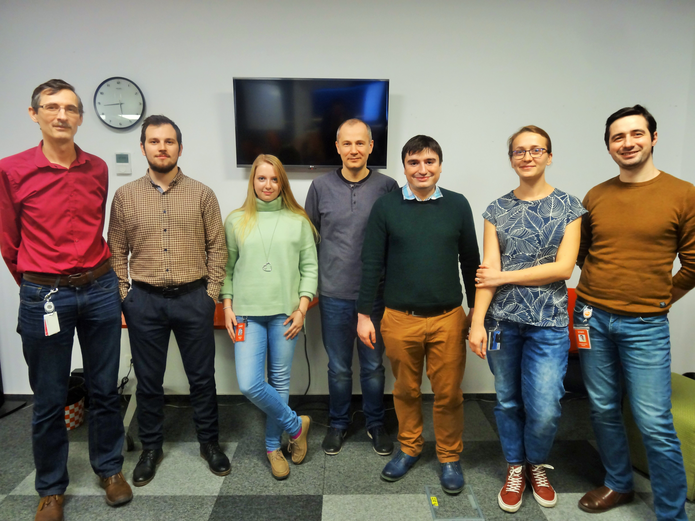
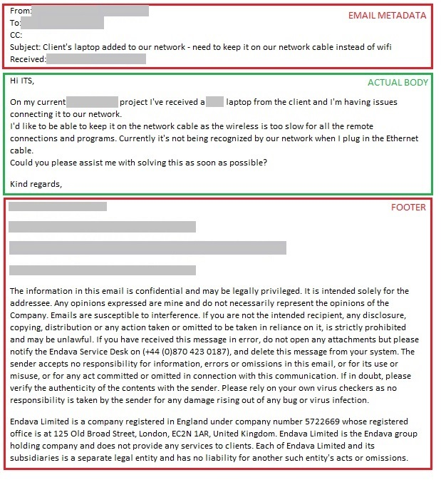
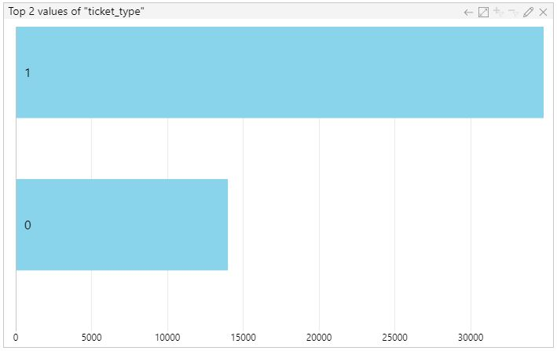
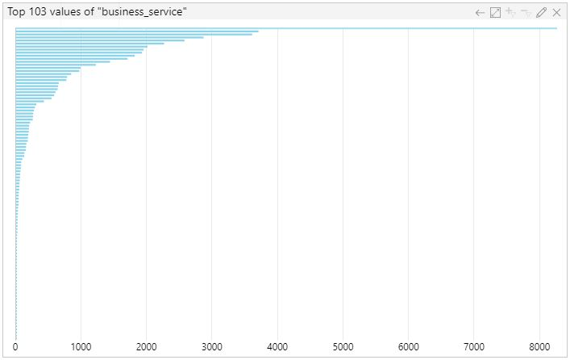
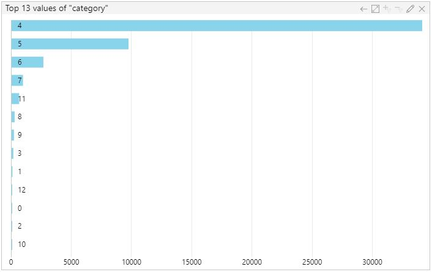
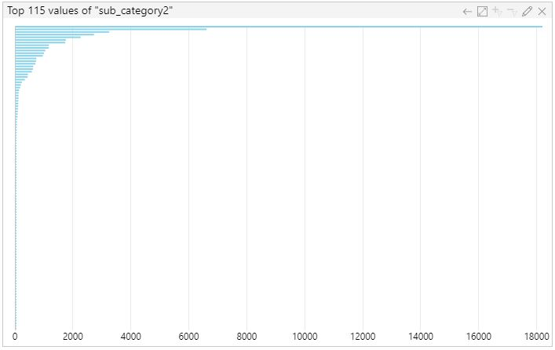

# Table of contents
1. [Project description](#1-project-description)  
2. [Results and learnings](#2-results-and-learnings)  
    2.1. [Main challenge and initial assumptions](#21-main-challenge-and-initial-assumptions)  
    2.2. [Dataset](#22-dataset)  
    2.3. [Training and evaluation results](#23-training-and-evaluation-results)    
    2.4. [Using the model](#24-using-the-model)
<!--
3. [Run sample](#3-run-sample)  
    3.1. [Setup](#31-setup)  
    3.2. [Train and evaluate the model](#32-train-and-evaluate-the-model)  
4. [Code highlights](#4-code-highlights)  
-->
<br>

# 1. Project description 
[[back to the top]](#table-of-contents)

This case study shows how to create a model for **text analysis and classification** and deploy it as a **web service in Azure cloud** in order to automatically **classify support tickets**.<br>
This project is a proof of concept made by Microsoft (Commercial Software Engineering team) in collaboration with [Endava](http://endava.com/en).<br>
Our combined team tried 3 different approaches to tackle this challenge using:
- [Azure Machine Learning Studio](https://studio.azureml.net/) - drag-and-drop machine learning tools
- [Microsoft Cognitive Toolkit (CNTK)](https://github.com/Microsoft/CNTK) - deep neural networks framework
- [Azure Machine Learning Workbench](https://docs.microsoft.com/en-us/azure/machine-learning/preview/quickstart-installation) - with Python and classic machine learning algorithms

In this repository we will focus only on AML Workbench and Python scripts used to solve this challenge.

<br>

#### What will you find inside:     #### 
- How to clean and prepare text data and featurize it to make it valuable for machine learning scenarios
- How to strip the data from any sensitive information and also anonymize/encrypt it
- How to create a classification model using Python modules like: [sklearn](http://scikit-learn.org/stable/), [nltk](https://www.nltk.org/), [matplotlib](https://matplotlib.org/), [pandas](https://pandas.pydata.org/)
- How to create a web service with a trained model and deploy it to Azure
- How to leverage Azure Machine Learning Services and AML Workbench to make working on ML projects easier, faster and much more efficient

<br>

#### The team: ####
- [Karol Żak](https://twitter.com/karolzak13) ([GitHub](https://github.com/karolzak)) - Software Development Engineer, Microsoft
- [Filip Glavota](https://twitter.com/fglavota) - Software Development Engineer, Microsoft
- [Ionut Mironica](https://www.linkedin.com/in/ionut-mironica-06b35a2a/) ([GitHub](https://github.com/imironica)) - Senior Developer, Endava 
- [Bogdan Dinu](https://www.linkedin.com/in/bogdanvdinu) - Senior Development Consultant, Endava
- [Bogdan Marin](www.linkedin.com/in/bogdanmmarin) ([GitHub](https://github.com/bogdanm-marin)) - Senior Developer, Endava 
- [Florin Vinca](https://www.linkedin.com/in/vinca-florin-442ba229/) - Senior Developer, Endava
- Ioana Raducanu - BI Analyst Developer, Endava
- [Andreea Tipau](https://www.linkedin.com/in/andreea-tipau-309aa1124/) - Developer, Endava




<br>

# 2. Results and learnings
[[back to the top]](#table-of-contents)

***Disclaimer:***
*This POC and all the learnings you can find bellow is an outcome of close cooperation between Microsoft and [Endava](http://endava.com/en). Our combined team spent total of 3 days in order to solve a challenge of automatic support tickets classification.*


## 2.1. Main challenge and initial assumptions ##
[[back to the top]](#table-of-contents)

- Main challenge we tried to solve was to create a model for automatic support tickets classification for Endavas helpdesk solution. As Endava stated: currently helpdesk operators waste a lot of time evaluating tickets and trying to assign values to properties like: `ticket_type, urgency, impact, category, etc.` for each submitted ticket
- The dataset we used is Endavas internal data imported from their helpdesk system. We were able to collect around 50k classified support tickets with original messages from users and already assigned labels
- In our POC we focused only on tickets submited in form of an email, similar to the one bellow:


<br>

## 2.2. Dataset ##    
[[back to the top]](#table-of-contents)

- For the sake of this repository, data have been stripped out of any sensitive information and anonymized (encrypted). In the original solution we worked on a full dataset without any encryptions. You can download anonymized dataset [here](https://privdatastorage.blob.core.windows.net/github/support-tickets-classification/datasets/all_tickets.csv)
- Example of anonymized and preprocessed data from AML Workbench view:

- After evaluating the data in AML Workbench we quickly discovered that distribution of values for most of columns we wanted to classify is strongly unbalanced with some of the unique values represented by even as low as 1-2 samples. There are [multiple technics](https://shiring.github.io/machine_learning/2017/04/02/unbalanced) to deal with that kind of issues but due to limited amount of time for this POC we were not able to test them in action.   
- Distribution of values for each column:

    ticket_type   |  business_service
    :-------------------------:|:-------------------------:
     |  

    impact   |  urgency 
    :-------------------------:|:-------------------------:
     |  

    category   |  sub_category1
    :-------------------------:|:-------------------------:
     | 

    sub_category2   |  
    :-------------------------:|
     |


<br>

## 2.3. Training and evaluation results ##
[[back to the top]](#table-of-contents)

In order to train our models, we used AML Workbench to run training jobs with different parameters and then compared the results and picked the one with the best values:


To train models we tested 2 different algorithms: [SVM](http://scikit-learn.org/stable/modules/generated/sklearn.linear_model.SGDClassifier.html) and [Naive Bayes](http://scikit-learn.org/stable/modules/naive_bayes.html#multinomial-naive-bayes). In both cases results were pretty similar but for some of the models, Naive Bayes performed much better (especially after applying [hyperparameters](https://en.wikipedia.org/wiki/Hyperparameter)) so at some point we decided to work with NB only.    

Below you can find some of the results of models we trained to predict different properties:

- ### **ticket_type** ###    
    We started from predicting the least unbalanced (and most important from Endavas business point of view) parameter which is `ticket_type` and after training the model and finding the best hyperparameters using [GridSearchSV](http://scikit-learn.org/stable/modules/generated/sklearn.model_selection.GridSearchCV.html) (which improved precision and recall by around 4%), we were able to achieve some really good results which you can see below:

<div>
<div style="float:left"></div>
<div style="float:left">

<pre>      class  precision    recall  f1-score   support

          0       0.97      0.95      0.96      2747
          1       0.98      0.99      0.98      6967

avg / total       0.98      0.98      0.98      9714

</pre>

</div>
<div style="clear:both"/>
</div>

- ### **business_service** ###

    `business_service` property is one of the unbalanced features with very low amount of samples/per class for most values.    
    We started from running the training on a subset of our dataset where we removed `business_service` values which were represented by less then 100 samples.    
    Unfortunately that didn't help much and we still had a lot of classes that were not at all recognized. So we continued to increase the minimum required number of samples per class untill we started to see some miningfull results:

<div>
<div style="float:left"></div>
<div style="float:left">

<pre>      class  precision    recall  f1-score   support

         32       0.66      0.95      0.78      1625
         36       0.63      0.73      0.68       792
          4       0.63      0.50      0.56       501
         40       0.68      0.59      0.63       465
         46       0.88      0.62      0.73       344
         51       0.96      0.15      0.25       301
         56       0.84      0.66      0.74       374
         63       0.62      0.13      0.21       367
         66       1.00      0.02      0.04       257
         67       0.67      0.67      0.67       574
         68       0.43      0.76      0.55       727
         70       0.84      0.49      0.62       352
         73       0.93      0.76      0.84       372

avg / total       0.70      0.65      0.62      7051

</pre>
</div>
<div style="clear:both"/>
</div>

- ### **category | impact | urgency** ###

    To predict `category`, `impact` and `urgency` we took the same approach as with `business_service` property but results looked even worse. It's obvious that such level of unbalance within the data makes it impossible to create a model with any miningful results.    
    If you would only look at mean/average value of `precision` and `recall` you could wrongly assume that results are quite well but if you would check the values of `support` for each class it would become clear that because one class which covers 70-90% of our data, the results are completely rigged:

<div>
<div style="float:left"></div>
<div style="float:left">

<pre> 'category'  precision    recall  f1-score   support

         11       1.00      0.03      0.06       120
          3       0.00      0.00      0.00        30
          4       0.82      0.98      0.89      6820
          5       0.87      0.65      0.74      1905
          6       0.65      0.09      0.15       543
          7       0.00      0.00      0.00       207
          8       0.95      0.49      0.65        43
          9       0.00      0.00      0.00        43

avg / total       0.80      0.82      0.79      9711

</pre>
</div>

<div style="clear:both"/>
</div>


<div>
<div style="float:left"></div>
<div style="float:left">

<pre>   'impact'  precision    recall  f1-score   support

          0       0.00      0.00      0.00       112
          1       0.00      0.00      0.00         8
          2       0.00      0.00      0.00        39
          3       0.98      1.00      0.99      9578

avg / total       0.97      0.98      0.98      9737

</pre>
</div>
<div style="clear:both"/>
</div>


<div>
<div style="float:left"></div>
<div style="float:left">

<pre>  'urgency'  precision    recall  f1-score   support

          0       0.00      0.00      0.00       335
          1       0.55      0.18      0.28      1336
          2       0.85      0.98      0.91      8066

avg / total       0.78      0.84      0.79      9737

</pre>
</div>
<div style="clear:both"/>
</div>


<br>

## 2.4. Using the model ##
[[back to the top]](#table-of-contents)

Final model will be used in form of a web service running on Azure and that's why we prepared a sample RESTful web service written in Python and using [Flask module](http://flask.pocoo.org/). This web service makes use of our trained model and provides API which accepts email body (text) and returns predicted properties.

You can find a running web service hosted on [Azure Web Apps](https://docs.microsoft.com/en-us/azure/app-service/app-service-web-overview) here: https://endavaclassifiertest1.azurewebsites.net/.    
The project we based our service on with code and all the deployment scripts can be found here: [karolzak/CNTK-Python-Web-Service-on-Azure](https://github.com/karolzak/CNTK-Python-Web-Service-on-Azure).

*Sample request and response in Postman:*


<br>


<!---

# 3. Run sample
### 3.1. Setup
[[back to the top]](#table-of-contents)


- **Download content of this repo**

    You can either clone this repo or just download it and unzip to some folder

- **Setup Python environment**

    In order for scripts to work you should have a proper Python environment. If you don't already have it setup then you should follow one of the online tutorials. To setup Python environment and all the dependencies required by CNTK on my local Windows machine, I used [scripted setup tutorial for Windows](https://docs.microsoft.com/en-us/cognitive-toolkit/setup-windows-binary-script). If you're using Linux then you might want to look into one of these [tutorials](https://docs.microsoft.com/en-us/cognitive-toolkit/Setup-CNTK-on-your-machine).
    Just bear in mind that this project was **developed and tested with CNTK 2.1 and it wasn't tested for any other version**.
    
    Even after setting up Python environment properly you might still witness some errors when running Python scripts. Most of those errors are related to missing modules or some 3rd party frameworks and tools (i.e. [GraphViz](http://www.graphviz.org/)). Missing modules can be easily [pip installed](https://packaging.python.org/tutorials/installing-packages/) and most of the required ones can be found in `requirements.txt` files for each folder with Python scripts.

    Please report if you'll find any errors or missing modules, thanks!

- **Download hotel pictures dataset (HotailorPOC2) and pretrained AlexNet model used for Transfer Learning**

    Go to [Detection/FasterRCNN](Detection/FasterRCNN) folder in the location were you unzipped this repo and run `install_data_and_model.py`. It will automatically download the `HotailorPOC2` dataset, pretrained AlexNet model and will generate mapping files required to train the model.
    
### 3.2. Train and evaluate the model
[[back to the top]](#table-of-contents)

After you go through setup steps you can start training your model.

In order to do it you need to run `FasterRCNN.py`script located in [Detection/FasterRCNN](Detection/FasterRCNN). 

I'm working on Windows 10 so I run the script from Anaconda Command Prompt which should be installed during setup steps.

Bear in mind that training the model might take a lot of time depending on the type of machine you are using for training and if you're using GPU or CPU.

```
python FasterRCNN.py
```

**TIP:** If you don't own any machine with heavy GPU you can use one of the ready to go [Data Science Virtual Machine images in Azure](https://azuremarketplace.microsoft.com/en-us/marketplace/apps/microsoft-ads.windows-data-science-vm).

When the training and evaluation will be completed, you should see something similar to this:

```
Evaluating Faster R-CNN model for 20 images.
Number of rois before non-maximum suppression: 550
Number of rois  after non-maximum suppression: 87
AP for            sink = 0.4429
AP for          pillow = 0.1358
AP for          toilet = 0.8095
AP for            lamp = 0.5404
AP for         curtain = 0.7183
AP for           towel = 0.0000
AP for             tap = 0.1111
AP for             bed = 0.8333
Mean AP = 0.4489
```

Trained model, neural network topology and evaluated images (with plotted results) can later be found in `Output` folder located in `Detection/FasterRCNN`.

<br><br>

# 4. Code highlights
[[back to the top]](#table-of-contents)

- [config.py](Detection/FasterRCNN/config.py) - most of variables are set in this file

    - These variables are responsible for chosing a dataset that will be used to train the model. Most important variables here are  :

        ```Python    
        __C.CNTK.DATASET = "HotailorPOC2"   

        [..]  
    
        if __C.CNTK.DATASET == "HotailorPOC2": #name of your dataset Must match the name set with property '__C.CNTK.DATASET'
            __C.CNTK.MAP_FILE_PATH = "../../DataSets/HotailorPOC2" # dataset directory
            __C.CNTK.NUM_TRAIN_IMAGES = 82 # number of images in 'positive' folder
            __C.CNTK.NUM_TEST_IMAGES = 20 # number of images in 'testImages' folder
            __C.CNTK.PROPOSAL_LAYER_PARAMS = "'feat_stride': 16\n'scales':\n - 4 \n - 8 \n - 12"
        ```

    - `IMAGE_WIDTH` and `IMAGE_HEIGHT` are used to determine the input size of images used for training and later on for evaluation:

        ```Python
        __C.CNTK.IMAGE_WIDTH = 1000
        __C.CNTK.IMAGE_HEIGHT = 1000
        ```

    - `BASE_MODEL` defines which pretrained model should be used for transfer learning. Currently we used only AlexNet. In future we want to test it with VGG16 to check if we can get better results then with AlexNet 

        ```Python
        __C.CNTK.BASE_MODEL = "AlexNet" # "VGG16" or "AlexNet" or "VGG19"
        ```

- [requirements.txt](Detection/FasterRCNN/requirements.txt)

    - It holds all the dependencies required by my scripts and CNTK libraries to work. It can be used with `pip install` command to quickly install all the required dependencies ([more here](https://pip.pypa.io/en/stable/user_guide/#requirements-files))
    
        ```
        matplotlib==1.5.3
        numpy==1.13.3
        cntk==2.1
        easydict==1.6
        Pillow==4.3.0
        utils==0.9.0
        PyYAML==3.12
        ```

- [install_data_and_model.py](Detection/FasterRCNN/install_data_and_model.py)

    - This script does 3 things:
        - Downloads pretrained model specified in [config.py](Detection/FasterRCNN/config.py) which will be later used for transfer learning:
            
            ```Python
            #downloads pretrained model pointed out in config.py that will be used for transfer learning
            sys.path.append(os.path.join(base_folder, "..", "..",  "PretrainedModels"))
            from models_util import download_model_by_name
            download_model_by_name(cfg["CNTK"].BASE_MODEL)
            ```
        
        - Downloads and unzips our sample HotailorPOC2 dataset:

            ```Python
            #downloads hotel pictures classificator dataset (HotailorPOC2)
            #comment out lines bellow if you're using a custom dataset
            sys.path.append(os.path.join(base_folder, "..", "..",  "DataSets", "HotailorPOC2"))
            from download_HotailorPOC2_dataset import download_dataset
            download_dataset()    
            ```

        - Creates mappings and metadata for dataset:
            
            ```Python
            #generates metadata for dataset required by FasterRCNN.py script
            print("Creating mapping files for data set..")
            create_mappings(base_folder)
            ```

- [FasterRCNN.py](Detection/FasterRCNN/FasterRCNN.py)

    - We use this script for training and testing the model. It makes use of specific variables in [config.py](Detection/FasterRCNN/config.py). This script comes unmodified from original [CNTK repository on GitHub](https://github.com/Microsoft/CNTK) (version 2.1)

